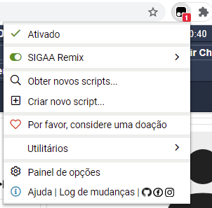

# SIGAA Remix Beta Versão 0.4
Extensão que melhora a experiência do usuário na plataforma SIGAA da UnB. Necessário a extensão Tampermonkey instalada no navegador.
 
 

 

Download:
 
1ª Etapa) [Instalar a extensão Tampermonkey para executar o SIGAA Remix](https://chrome.google.com/webstore/detail/dhdgffkkebhmkfjojejmpbldmpobfkfo) 
[Site Oficial do Tampermonkey](https://www.tampermonkey.net/) 
2ª Etapa) [Instalar o SIGAA Remix no Tampermonkey](https://github.com/luisrguerra/unb-sigaa-remix-tampermonkey/raw/main/SIGAA%20Remix.user.js)
 
 
Ao clicar no link "Instalar SIGAA Remix" aprecerá essa tela, clique em instalar para terminar de instalar a extensão.
 

 
Ao ter tudo instalado aparecerá o icone da extensão do Tampermonkey (ícone preto) no seu Google Chrome, nela aparecerá o SIGAA Remix ativado se ele foi instalado corretamente.
Clicando no nome SIGAA Remix você pode desativar e ou remover o script. 
 

 
Para remover a extensão Tampermonkey do seu navegar vá em mais ferramentas, extensões e na página de extensões encontre o Tampermonkey e clique em remover.
 

