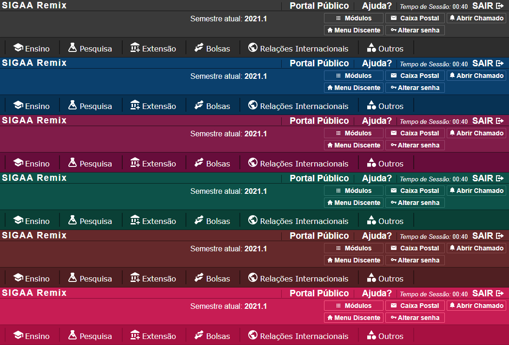
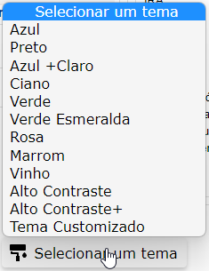
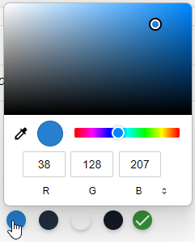
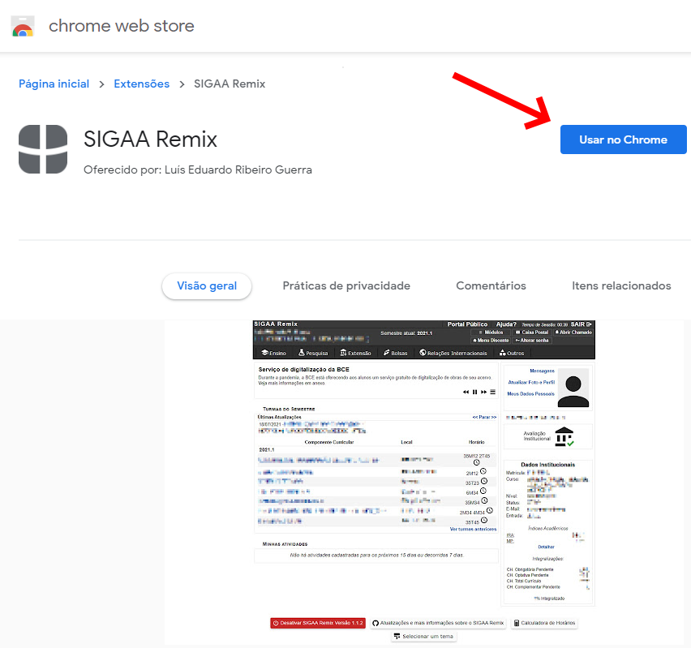
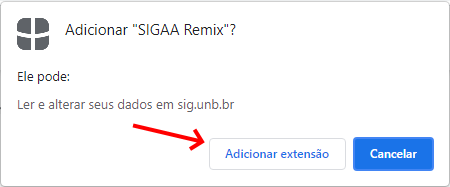

# SIGAA Remix Versão 1.1.1
O SIGAA Remix é uma extensão para Google Chrome desenvolvida com o foco de melhorar a experiência do usuário na plataforma SIGAA da UnB. 
Através de vários pequenos ajustes, o SIGAA Remix moderniza o site, tirando aquela cara de anos 90, melhorando a aparência 
e aumentando o tamanho das letras.
<br>
<br>
Depois de instalado:
<br>

<br>
Antes:
<br>

<br>
### Recursos do SIGAA Remix:
Novos ícones em alta resolução:
<br>

<br>
<br>
Vários temas para customizar a interface do seu SIGAA:
<br>

<br>

<br>
<br>
No SIGAA Remix você pode criar um tema customizado do seu jeito:
<br>

<br>
<br>
Para evitar qualquer problema com atualizações futuras do SIGAA, é adicionado um botão no final do site que permite desativar as modificações e outro botão que dá acesso à página do Github do projeto:
<br>
<br>

<br>

# Como instalar (Chrome Web Store):


<br>


<br>
(Mensagem padrão de instalação de extenção no Chrome)

### Download:
[Página do SIGAA Remix na Chrome Web Store](https://chrome.google.com/webstore/detail/sigaa-remix/plpmdkigbdddlaihbfbpjgcknmefjijf?hl=pt-BR&authuser=0)<br>

# Como instalar (Versão Tampermonkey):

[Guia de Instalação SIGAA Remix (Versão Tampermoneky)](https://github.com/luisrguerra/unb-sigaa-remix/wiki/Guia-de-Instala%C3%A7%C3%A3o-SIGAA-Remix-(Vers%C3%A3o-Tampermoneky))

Para instalar o SIGAA Remix (Versão Tampermonkey) você precisará instalar primeiro a extensão ```Tampermonkey``` para o SIGAA Remix funcionar.

### Download:

1ª Etapa) [Instalar a extensão Tampermonkey para executar o SIGAA Remix](https://chrome.google.com/webstore/detail/dhdgffkkebhmkfjojejmpbldmpobfkfo)<br>
2ª Etapa) [Instalar o SIGAA Remix versão 1.1.1 no Tampermonkey](https://github.com/luisrguerra/unb-sigaa-remix-tampermonkey/raw/main/SIGAA%20Remix.user.js)
