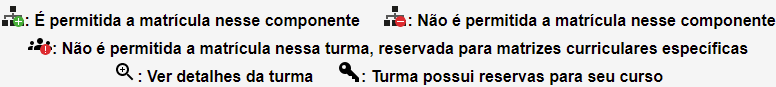
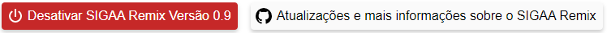
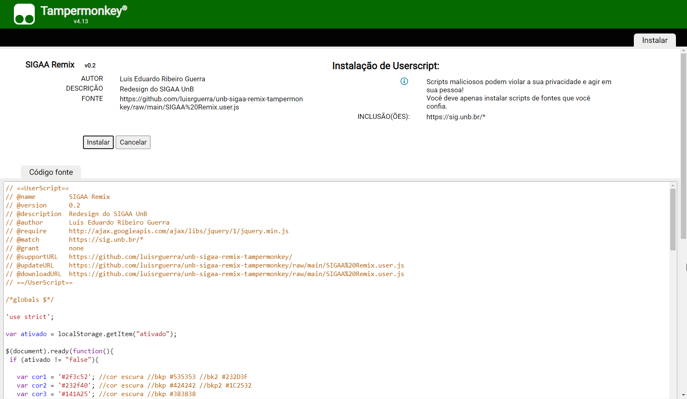
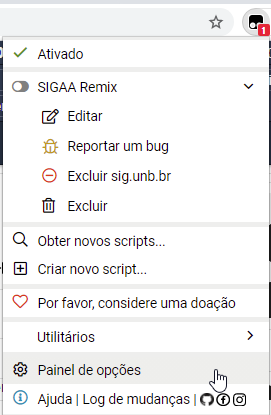
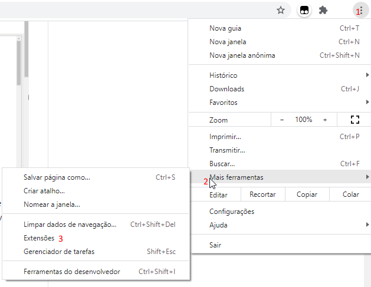
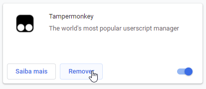

# SIGAA Remix Versão 1.1.1
O SIGAA Remix é uma extensão para Google Chrome desenvolvida com o foco de melhorar a experiência do usuário na plataforma SIGAA da UnB. 
Através de vários pequenos ajustes, o SIGAA Remix moderniza o site, tirando aquela cara de anos 90, melhorando a aparência 
e aumentando o tamanho das letras.
<br>
<br>
Depois de instalado:
<br>

<br>
Antes:
<br>

<br>
### Recursos do SIGAA Remix:
Novos ícones em alta resolução:
<br>

<br>
<br>
Para evitar qualquer problema com atualizações futuras do SIGAA, é adicionado um botão no final do site que permite desativar as modificações e outro botão que dá acesso à página do Github do projeto:
<br>
<br>

<br>

# Como instalar:

Para instalar o SIGAA Remix você precisará instalar primeiro a extensão ```Tampermonkey``` para o SIGAA Remix funcionar.

Download:
<br>
1ª Etapa) [Instalar a extensão Tampermonkey para executar o SIGAA Remix](https://chrome.google.com/webstore/detail/dhdgffkkebhmkfjojejmpbldmpobfkfo)<br>
[Site Oficial do Tampermonkey para mais informações](https://www.tampermonkey.net/)<br>
2ª Etapa) [Instalar o SIGAA Remix versão 1.1.1 no Tampermonkey](https://github.com/luisrguerra/unb-sigaa-remix-tampermonkey/raw/main/SIGAA%20Remix.user.js)
<br>
<br>
Ao clicar no link "Instalar SIGAA Remix" aparecerá essa tela, clique em instalar para terminar de instalar a extensão. Após instalada a extensão, toda vez que você acessar o SIGAA UnB o SIGAA Remix será executado.
<br>

<br>
### Desinstalação:
Ao ter tudo instalado aparecerá o icone da extensão do Tampermonkey (ícone preto) no seu Google Chrome, nela aparecerá o SIGAA Remix ativado se ele foi instalado corretamente.
Clicando no nome SIGAA Remix você pode desativar e ou remover o script. 
<br>


<br>
Para remover a extensão Tampermonkey do seu navegar vá em mais ferramentas, extensões e na página de extensões encontre o Tampermonkey e clique em remover.
<br>


