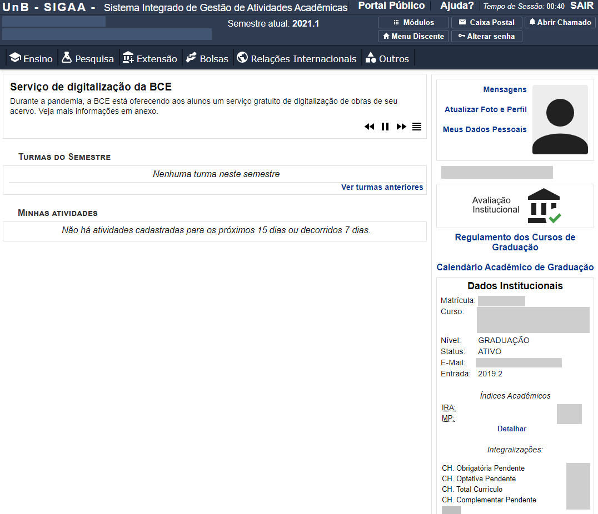

# SIGAA Remix Beta Versão 0.1
Extensão que melhora a experiência do usuário na plataforma SIGAA da UnB. Necessário a extensão Tampermonkey instalada no navegador.
 
 

 
[Site Oficial do Tampermonkey](https://www.tampermonkey.net/){:target="_blank" rel="noopener"}
 
Download:
 
1º) [Instalar Tampermonkey](https://chrome.google.com/webstore/detail/dhdgffkkebhmkfjojejmpbldmpobfkfo){:target="_blank" rel="noopener"}
 
2º) [Instalar SIGAA Remix](https://github.com/luisrguerra/unb-sigaa-remix-tampermonkey/raw/main/SIGAA%20Remix.user.js){:target="_blank" rel="noopener"}

