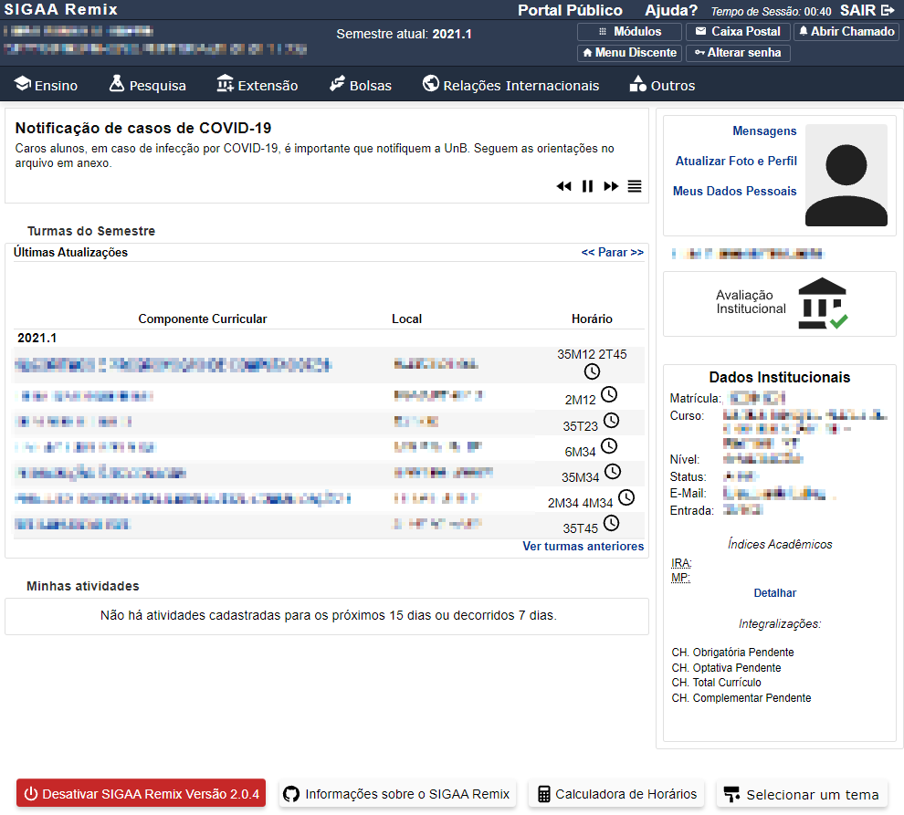

# SIGAA Remix Beta Versão 0.5
O SIGAA Remix é uma extensão para Google Chrome desenvolvida com o foco de melhorar a experiência do usuário na plataforma SIGAA da UnB. 
Através de vários pequenos ajustes, o SIGAA Remix moderniza o site, tirando aquela cara de anos 90, melhorando a aparência 
e aumentando o tamanho das letras. Para evitar qualquer problema com atualizações futuras do SIGAA, é adicionado um botão no final do
site que permite desativar as modificações.
 
 
Antes:
 

Depois:
 

 
Novos ícones em alta resolução:
 

 

Download:
 
1ª Etapa) [Instalar a extensão Tampermonkey para executar o SIGAA Remix](https://chrome.google.com/webstore/detail/dhdgffkkebhmkfjojejmpbldmpobfkfo) 
[Site Oficial do Tampermonkey](https://www.tampermonkey.net/) 
2ª Etapa) [Instalar o SIGAA Remix versão 0.5 no Tampermonkey](https://github.com/luisrguerra/unb-sigaa-remix-tampermonkey/raw/main/SIGAA%20Remix.user.js)
 
 
Ao clicar no link "Instalar SIGAA Remix" aprecerá essa tela, clique em instalar para terminar de instalar a extensão.
 

 
Ao ter tudo instalado aparecerá o icone da extensão do Tampermonkey (ícone preto) no seu Google Chrome, nela aparecerá o SIGAA Remix ativado se ele foi instalado corretamente.
Clicando no nome SIGAA Remix você pode desativar e ou remover o script. 
 

 
Para remover a extensão Tampermonkey do seu navegar vá em mais ferramentas, extensões e na página de extensões encontre o Tampermonkey e clique em remover.
 

